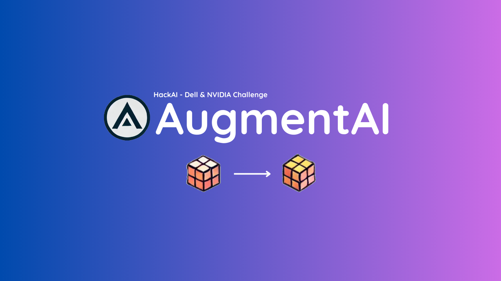
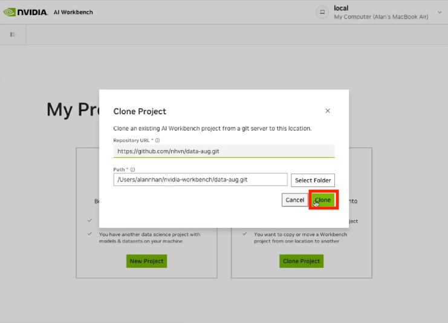
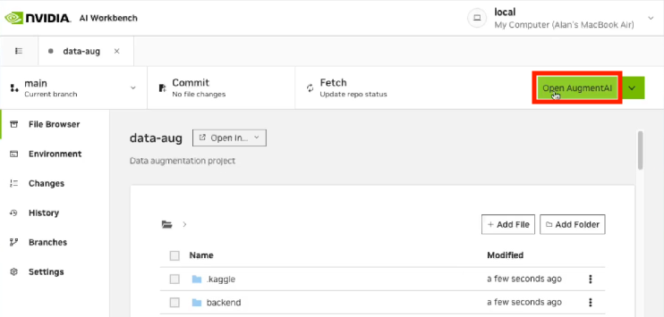
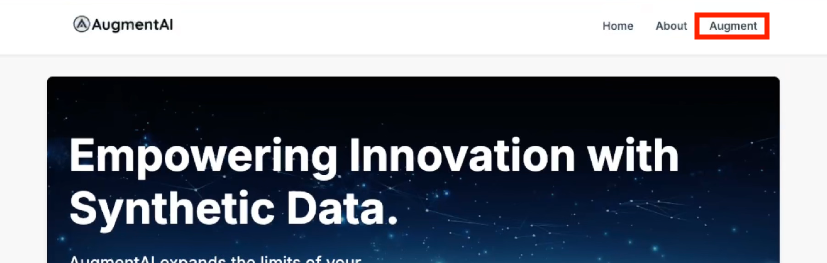
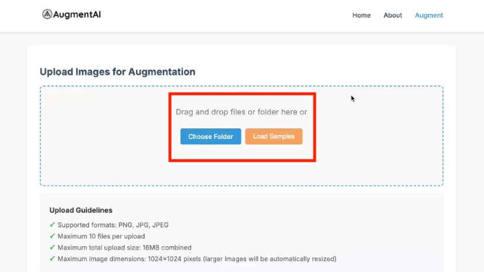
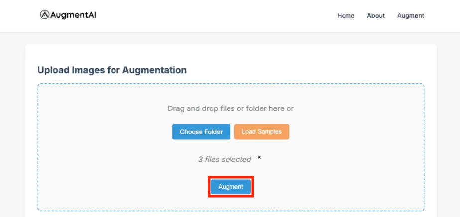

# AugmentAI - Data Augmentation Tool

#### This project provides an image augmentation tool using **Generative AI** models, specifically designed and optimized for **NVIDIA AI Workbench**.
---

## Table of Contents
- [Description](#description)
- [Features](#features)
- [Environment Setup](#environment-setup)
  - [Required Environment Variables](#required-environment-variables)
  - [Service Levels](#service-levels)
- [Installation & Setup](#installation--setup)
  - [Prerequisites](#prerequisites)
  - [Steps](#steps)
- [Accessing the Application](#accessing-the-application)
- [Using the Application](#using-the-application)
- [Limitations and Guidelines](#limitations-and-guidelines)
- [Troubleshooting](#troubleshooting)
- [Development Notes](#development-notes)
- [Contact](#contact)
- [Blog Post](#blog-post)

---

## Description
AugmentAI allows users to upload image datasets and augment them using generative models. The system uses Stability AI API for high-quality image generation and falls back to a local GAN model when needed. Built specifically for **NVIDIA AI Workbench**, the application utilizes GPU acceleration for fast and efficient image processing.

---

## Features
- **Infrastructure**
  - Built specifically for NVIDIA AI Workbench
  - Easy deployment and management
  - No complex setup needed

- **User Experience**
  - Simple, clean interface
  - Folder upload support
  - Maintains original image dimensions
  - Direct result downloads

- **Future Potential**
  - Framework ready for multi-modal expansion
  - Could integrate multiple AI models
  - Potential for text and tabular data support

---

## Environment Setup

### Required Environment Variables
- `STABILITY_API_KEY`: Required for high-quality image generation (Default demo key is included for the judges)
  - Can be obtained from [Stability AI platform](https://platform.stability.ai/)
  - Set in Workbench environment or `.env` file
  - Note: System will fallback to local GAN if API is unavailable

### Service Levels
- **Primary Service**: Uses Stability AI API
  - Requires valid API key and available credits
  - Produces high-quality images at original dimensions
  - Faster processing time

- **Fallback Service**: Uses Local GAN
  - Activates automatically if API is unavailable
  - Produces 64x64 pixel images
  - Limited to nature-style variations
  - No API key required

---

## Installation & Setup

### Prerequisites
- NVIDIA AI Workbench installed and configured
- Docker Desktop running
- Git installed
- System Requirements:
  - 8GB RAM minimum
  - 5GB free disk space
- Software Versions:
  - Docker Desktop 4.x or higher
  - Git 2.x or higher
  - Python 3.8+ (handled by container)

### Steps
1. Open NVIDIA AI Workbench
   - Select "Clone Project"
   - Drop in `https://github.com/nhvn/data-aug.git`, leave the default path, and click "Clone"
  

2. Start the Application:
   - In Workbench, click on "Open AugmentAI" (or alternatively, go to Environment > Applications > AugmentAI)
  
   - The application will open automatically in your default browser

---

## Accessing the Application
The application is available at: `http://localhost:10000/projects/data-aug/applications/AugmentAI/`

---

## Using the Application
1. Ensure the app is launched through NVIDIA AI Workbench
2. Click on 'Augment' in the navigation bar to navigate to the "Upload" page
  
4. Upload images in any of these ways:
  - Click "Load Samples" to use provided test images
  - Drag and drop a folder or individual images
  - Click "Choose Folder" to select files from your computer
  

4. Generate augmented images:
  - Click "Augment" to process the images
  
  - Wait for processing to complete
  - Files will automatically download as a ZIP

Note: If the API is unavailable, the system will automatically fall back to a local model (may result in lower quality outputs).

---

## Limitations and Guidelines
- Supported formats: PNG, JPG, JPEG
- Maximum 10 files per upload
- Maximum total upload size: 16MB
- Maximum image dimensions: 1024x1024 pixels (larger images automatically resized)
- Folder and file drag-and-drop supported
- Upload status indication provided

---

## Troubleshooting
If you encounter issues:
1. Ensure Docker Desktop is running
2. Verify NVIDIA AI Workbench is properly installed
3. Check the application logs in Workbench
4. Ensure your API key is properly configured (if using Stability AI)
5. Try restarting the application through Workbench

---

## Development Notes
This project is specifically designed for NVIDIA AI Workbench. Key configurations include:
- NVIDIA AI Workbench integration
- Stability AI API integration
- Local GAN model fallback
- Static file serving optimization

---

## Contact
If you're a judge and need access or have questions, please reach out and I will respond as soon as possible.

---

## Blog Post
Read the full blog post [here](./blogpost.md).
